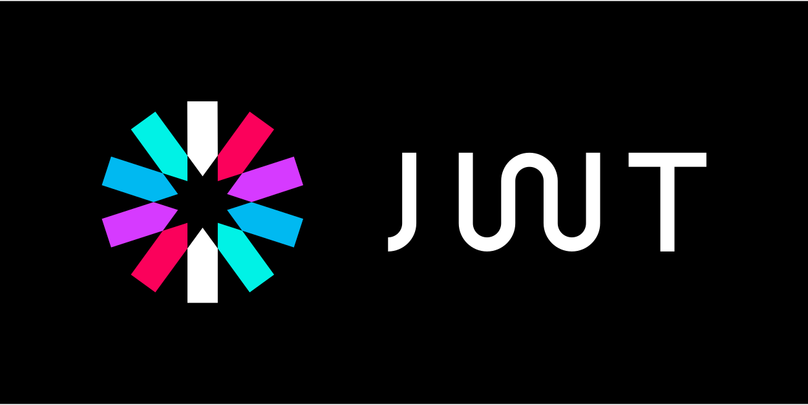

<h1 align="center"><b>JWT</b></h1>
 

JSON Web Token (JWT) is an open standard (RFC 7519) that defines a compact and self-contained way for securely transmitting information between parties as a JSON object. This information can be verified and trusted because it is digitally signed. JWTs can be signed using a secret (with the HMAC algorithm) or a public/private key pair using RSA or ECDSA

<h2>Tecnologias usadas</h2>

 

- **Front-End Development**:
    

- **Back-End Development**: 
    

- **Softwares and Tools**: 
    

- **Databases**:
   
  

 

<h3>Realizar los siguientes puntos de JWT:</h3>

- Login and Register HTML5, CSS3 & JS. ✔
- Registro de usuario. ✔
- Autenticacion de usuario. ✔
- Generacion de Token. ✔
- Generacion del Token Refresh. ✔
- Pruebas de la Anotacion [Authorize]. ✔
